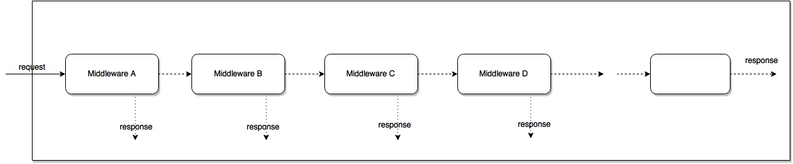

# GoNode - Modulo 1

## O que é o NodeJS?

NodeJS é uma plataforma que permite rodar Javascript fora do browser. Ele é cross-plataform e open-source. O Node se diferencia de linguagens que normalmente são usadas no backend, como PHP e Ruby, pois ele tem uma arquitetura conhecida por event-driven. Arquitetura que permite operações de I/O assíncronas. Operações que não tornam o processamento blocante.

## Criando seu primeiro servidor HTTP

O Node possui uma biblioteca para criar servidores HTTP. Para isso basta importar no seu código e levantar o servidor. O código abaixo demonstra.

```javascript
    const http = require('http');

    http.createServer((req, res) => {
        console.log(req);
        return res.end('Hello World :)');
    }).listen(3000);
```

__Explicação:__ A biblioteca foi chamada e adicionada à variavel http. Então usamos a variavel para chamar a função createServer. Dentro dela passamos uma função que tem como parâmetros a requisição (req) e a resposta (res). Imprimos a requisição no consolo. Logo depois retornamos uma resposta com "Hello World :)". Por fim informamos em qual porta vamos levantar o servidor, a porta escolhida foi a 3000.

## O que é o Express?

Para tratarmos as rotas, as requisições de maneira mais fácil vamos utilizar um framework chamado ExpressJS. Ele é uma aplicação Web que fornece uma API simples para criar sites, aplicativos web e back-ends. Por conta dele não precisaremos nos preocupar com protocolos, processos, entre outras de baixo nivel.

##### Instalando o Express.

 1. Executamos o comando __yarn add express__;

##### Levantando servidor HTTP com ExpressJS

```javascript
    const express = require('express');
    const app = express();
    
    app.get('/', (req, res) => res.send(`Bem-vinde ao ${req.AppName}, ${req.query.name}`));

    app.get('/login/:name', (req, res)=> res.json({ message: `Bem vinde, ${req.params.name}` }));

    app.listen(3000);
```
__Explicação:__ Primeiro criamos uma variavel e importamos o express, em seguida criamos uma variavel chamada app e atribuimos o express sendo executado. Após preparar as variavel, criamos duas rotas. As duas utilizam o método GET, elas retornam mensagens de acordo com a URL visitada e os parâmetros passados. Por fim escolhemos a porta qual desejamos.

#### Middlewares

##### O que são?
Os middleware são funções que têm acesso ao objeto de requisição (req), ao objeto de resposta (res) e à próxima função de middleware no ciclo de requisição-resposta do aplicativo. A próxima função de middleware é geralmente denotada por uma variável denominada next.

Os middleware podem executar as seguintes tarefas:
* Execute qualquer código.
* Faça alterações na solicitação e nos objetos de resposta.
* Termine o ciclo de solicitação-resposta.
* Chame a próxima função de middleware na pilha.



##### Criando nosso próprio Middleware

```javascript
const logMiddleware = (req, res, next) => {
    console.log(`HOST: ${req.headers.host} | URL: ${req.url} | METHOD: ${req.method}`);

    req.AppName = 'GoNode';

    return next();
};

app.use(logMiddleware); // Para usar o Middlestare em todas as requisições
```


